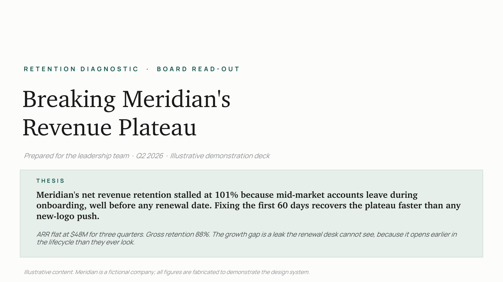
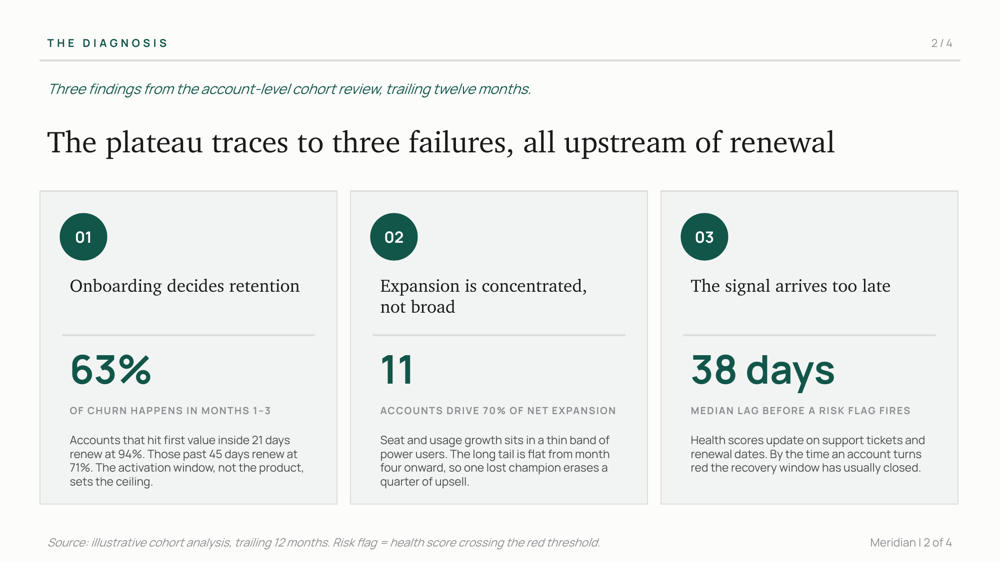
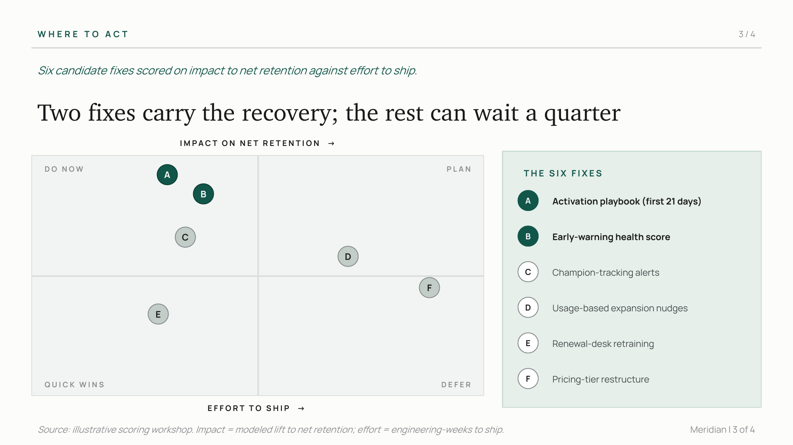
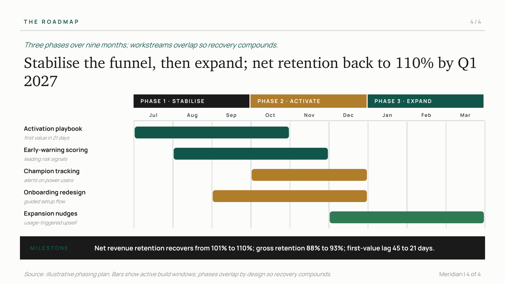

# Consulting decks that don't look AI-made

Most AI-generated decks announce themselves. The warm cream backgrounds, the three-bullet rhythm on every slide, the oversized section numerals, the same six fonts everyone uses. Executives have learned to spot the pattern in seconds, and the moment they do, the argument loses weight before it's read.

This is an open **Agent Skill** that builds strategy decks which avoid that trap. It pairs a design language engineered against the tells with the structural logic of how strategy work is actually built. The output reads like a person who knows the subject made it.

Install it into Claude Code or the Claude desktop app and ask for a deck.

## The problem it solves

Three things go wrong with most decks, AI-assisted or not:

1. **They look generic.** Template aesthetics signal low effort. A board notices.
2. **They read like filler.** Vague claims, hedged language, the vocabulary of a press release. No specific number anyone can act on.
3. **They don't carry an argument.** Slides labelled by topic instead of conclusion, so the reader assembles the "so what" themselves.

A deck is a decision tool. If it doesn't move a decision, the design was beside the point.

## Sample output

Four slides from the included demo build. The company, "Meridian," is fictional and every figure is fabricated to show the design system.






## Where to run it

It's an Agent Skill, so it runs anywhere Claude does. **Claude Code gives the best experience by far.** It reads the skill's files directly, runs the build script, and writes an editable `.pptx` straight into your project, because it has full access to your files and folders. Cowork is a close second. Chat is for the thinking work.

Whatever the surface, the flow is the same once it triggers: a short brief, then a **ghost deck** (action titles + a layout per slide) for your sign-off, then it writes its own build script and produces the deck. You get an editable `.pptx`, not a screenshot.

### Claude Code (recommended)

```bash
git clone https://github.com/umarmsharif/presentation-consulting-system.git \
  ~/.claude/skills/consulting-deck-builder
cd ~/.claude/skills/consulting-deck-builder && npm install
```

Start a new session and ask:

> "Build a diagnostic deck on our churn problem, 8 slides, Slate theme."

Claude loads the skill, runs the ghost-deck flow, then renders an editable PowerPoint into your working folder. It can open every reference file and run the build on the spot, so it can also render preview images and iterate. That direct file and folder access is why Claude Code is the fullest experience.

### Cowork (Claude desktop app)

Cowork doesn't scan your skills folder, so install it once by upload:

1. Zip the folder so it unzips to `consulting-deck-builder/SKILL.md`.
2. **Settings → Capabilities**: enable Skills and code execution.
3. **Customize → Skills → `+` → Create skill → Upload a skill**, and choose the zip.

Then ask it to build a deck. Cowork has local file access too, so it can write the `.pptx` into your folders.

### Chat (claude.ai)

Same upload path as Cowork: **Customize → Skills → Upload a skill**. Chat is strongest for the brief, the ghost deck, the action titles, and the slide content. With code execution enabled it can also generate a downloadable `.pptx`, but there's no persistent filesystem, so it's a download-based flow rather than files written into a project.

Full step-by-step (zip command, requirements, running the demo): see [INSTALL.md](INSTALL.md).

### Other coding agents (Codex, Cursor, Gemini, Cline, Windsurf, opencode)

The repo ships a portable [`AGENTS.md`](AGENTS.md) entry point that Codex, opencode, Gemini CLI, Amp, and Antigravity read natively, plus rule files for Cursor (`.cursor/rules/`), Windsurf (`.windsurf/rules/`), and Cline (`.clinerules/`). Clone the repo and an agent working inside it can build decks; to use it in your own projects, copy `AGENTS.md` (or the relevant rule file) into that project or your global agent config. Any of these agents can run the pptxgenjs build, so they produce a real `.pptx`, not just an outline.

## What's included

- **8 themes**: complete palettes and type pairings (Bright White & Pine, Slate, Oxblood, Solarized, Paper, Mono, Ink, Midnight).
- **A pattern catalogue**: workhorse exhibits (diagnostic three-panel, impact/effort matrix, phased gantt, waterfall, comparison tables, stat heroes) plus denser composites.
- **Chart guidance**: a message-to-chart-type guide and the honesty rules (no 3D, direct labels, zero baselines, logical ordering).
- **A working example**: `examples/build_demo.js` renders the four slides above.
- **A title linter**: `scripts/check_titles.js` flags topic-labels that should be action titles.
- **Prose discipline**: built-in guidance to strip the vocabulary and rhythms that read as AI.

## What's not here (the full version)

This open release gives you the design system and the workflow. The private build I use with clients adds the depth:

- A reference library pattern-matched against 600+ recent consulting decks.
- The full exhibit library and per-archetype pattern pools.
- A voice layer tuned to a specific author.
- A learning loop that feeds delivered-deck QA back into the system.

If you have a deck that has to land in front of a board, an investor, a client, or a hard internal decision, that's where I come in.

## Work with me

I'm Umar Sharif. I build AI systems for businesses and share what I learn. This is one of them.

**Email:** umarmsharif@gmail.com

## License

MIT, see [LICENSE](LICENSE). Use it, modify it, ship it. Attribution appreciated, not required.
